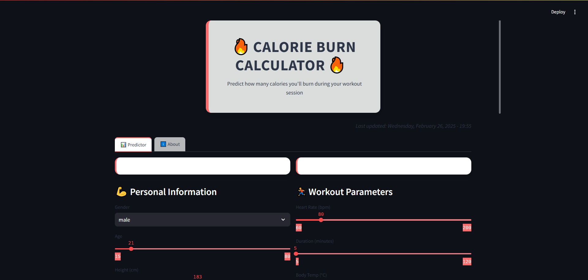

# 🔥 Calories Burn Predictor


The **Calories Burn Predictor** is a web application built with Streamlit that predicts how many calories you'll burn during a workout session based on your personal information and workout parameters. It uses a machine learning model to provide accurate estimates and is designed to be user-friendly and visually appealing.


---

## 🚀 Features

- **Personalized Predictions**: Input your gender, age, height, weight, heart rate, body temperature, and workout duration to get a calorie burn estimate.
- **Interactive Interface**: A clean and modern UI with sliders, buttons, and dynamic animations.
- **Fun Equivalents**: See your calorie burn in terms of cola cans, pizza slices, and chocolate bars.
- **Responsive Design**: Works seamlessly on both desktop and mobile devices.
- **Motivational Messages**: Get encouraging feedback based on your predicted calorie burn.

---

## 🛠️ How It Works

1. **Input Your Data**:
   - Enter your personal details (gender, age, height, weight).
   - Provide workout parameters (heart rate, body temperature, duration).

2. **Predict Calories Burned**:
   - Click the "Calculate Calories Burned" button.
   - The app sends your data to a machine learning model via an API and displays the predicted calorie burn.

3. **View Results**:
   - See your predicted calorie burn in a visually appealing format.
   - Get fun equivalents (e.g., how many cola cans or pizza slices you burned).
   - Receive motivational feedback based on your results.

---

## 🖥️ Technologies Used

- **Frontend**: Streamlit (Python framework for building web apps)
- **Backend**: Python, FastAPI (for serving the machine learning model)
- **Machine Learning**: Scikit-learn, XGBoost, or any other model (depending on your backend implementation)
- **Styling**: Custom CSS for a modern and responsive design
- **Deployment**: Streamlit Sharing, Docker, or any cloud platform (e.g., AWS, GCP, Heroku)

---

## 🛠️ Setup and Installation

### Prerequisites
- Python 3.8 or higher
- Streamlit (`pip install streamlit`)
- Requests (`pip install requests`)

### Steps to Run Locally
1. Clone the repository:
   ```bash
   git clone https://github.com/your-username/calories_burn.git
   cd calories-burn-predictor
